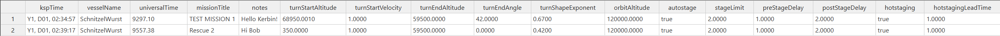
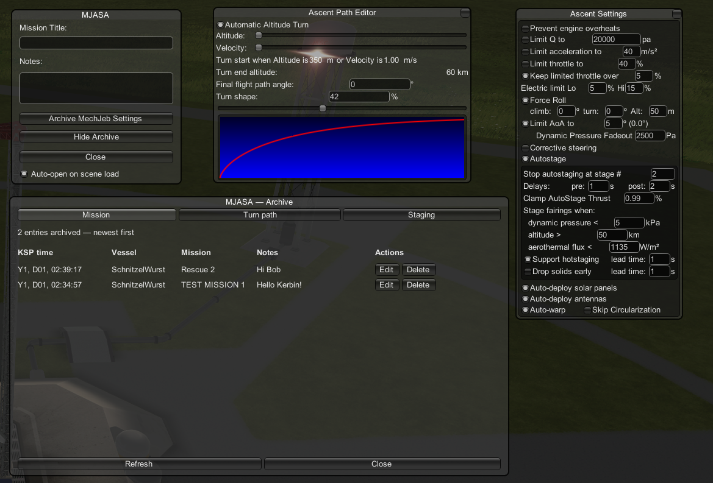
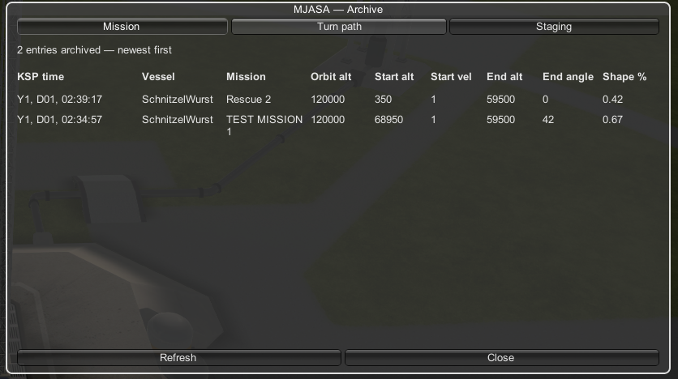
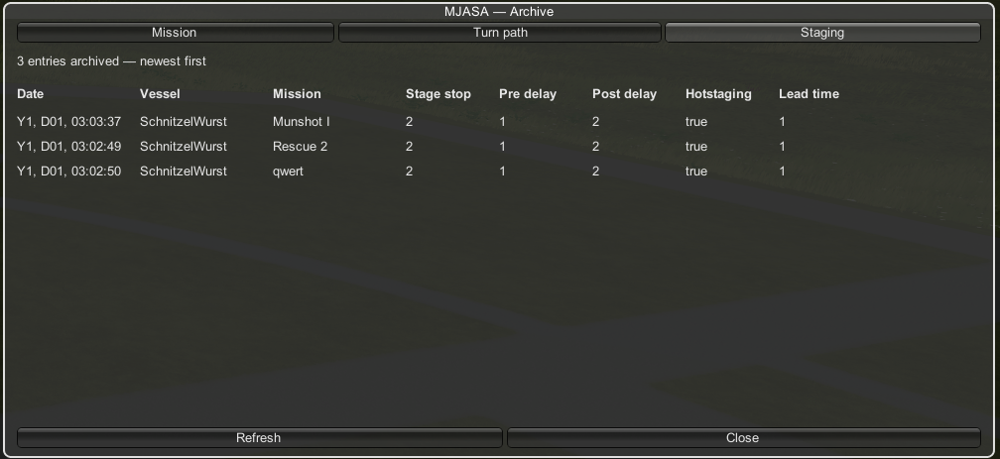

# MJASA — MechJeb Ascent & Staging Archive

Archives MechJeb ascent and staging settings to a CSV file,
adds an in-game viewer of the CSV grouped in Mission, Turn Path and Staging tabs.

## Requirements
- Kerbal Space Program 1.8+
- MechJeb2

## Installation
Place the `MJASA` folder with the dll and icon into your KSP `GameData` directory.

## Usage
1. Open the MJASA panel via the toolbar button (flight scene only)
2. Enter a mission title and optional notes
3. Click **Archive MechJeb Settings** to save the current MechJeb configuration
4. Click **Show Archive** to browse or delete past entries
5. When editing the CSV file manually you can use the **Refresh** button to update the rows ingame

## File Location
`GameData/MJASA/mjasa-archive.csv`

## Screenshots
### CSV FILE

### UI

- MJASA Mission Archive (+ MechJeb Autopilot UI)

- Saved ascent path values

- Saved staging values

